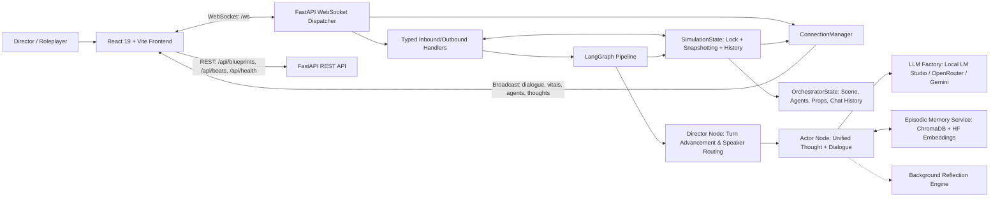

# 🎭 PersonaPlay Pro: Multi-Agent AI Story & Conversational Simulation

PersonaPlay Pro is an advanced, multi-agent AI theatrical and conversational simulation engine. It casts autonomous Large Language Model (LLM) agents into rich, dynamic scenarios where they inhabit distinct personas, harbor covert motives, form evolving interpersonal relationships, and improvise authentic spoken dialogue, physical actions, and inner thoughts within a live simulated environment.

A human participant can step into the simulation in two ways:
1. **The Director**: Wielding god-mode powers to inject plot twists, whisper confidential in-ear directives to specific actors, adjust interpersonal tension, rewind turns, or retake lines.
2. **The Actor (Direct Roleplay)**: Stepping into the shoes of any character on stage and speaking directly into the scene, engaging in real-time conversational back-and-forth with AI companions.

Built with **FastAPI**, **LangGraph**, and **React 19**, PersonaPlay features an asynchronous additive concurrency model ensuring human interventions merge seamlessly with background LLM generation without race conditions or overwriting user actions.

---

## 🌟 Core Features & Innovations

### 1. 👤 Human Realism Engine & Anti-Theatrical Overhaul
- **Authentic Conversational Framing**: Eliminates artificial stage metaphors ("advance the plot", "live theater"). Characters act as real human beings having authentic, unscripted conversations in a shared space with no fourth wall.
- **Natural Speech & Disfluencies**: Supports organic human speech patterns—hesitations, trailing off (`...`), self-corrections (*"Tuesday—wait, no, Wednesday"*), and realistic micro-actions in parentheses *(takes a sip)*, *(glances at phone)*.
- **Dynamic Brevity**: Breaks free from mandatory multi-sentence monologues; characters can react naturally with short fragments (*"Wait, what?"*, *"Since when?"*, *"Yeah, I guess."*) or full explanations depending on emotional intensity.

### 2. 🎯 Conversational Anchoring & Anti-Deflection Engine
- **Immediate Conversational Focus**: High-priority prompt anchoring ensures characters directly address the exact last statement or action made by their conversation partner instead of forcing their own hidden agendas.
- **Strict Anti-Deflection Rules**: Prohibits models from dodging direct confessions, questions, or dramatic statements by offering tea, water, snacks, or changing the subject.
- **Lexical Relevance Repair**: If a generated reply fails to acknowledge the user's manual input, the engine triggers a targeted rewrite pass to maintain conversational continuity.

### 3. ⚡ Single-Pass Unified Generation (~2–3s Turn Latency)
- **Autoregressive Thought-Then-Dialogue**: In a single prompt pass, the LLM first generates its private gut thought (`thought`) followed immediately by its spoken line (`dialogue`), conditioning spoken words on internal psychology.
- **Zero Phantom Monologue Waste**: Eliminates redundant background monologue calls for idle actors, cutting turn latency by over 60% compared to legacy multi-pass pipelines.
- **Cached Rolling History Compression**: Periodic prefix-scoped summarization replaces per-turn history re-summarization, drastically reducing prompt token bloat and preventing hallucinated narrative drift.

### 4. 💬 Manual Character Dialogue & Interactive Roleplay
- **Always-Visible Dialogue Bar**: Docked at the bottom of the theater panel, allowing the user to select any character on stage and speak as them.
- **Strict Turn Alternation Guarantee**: Entering dialogue as Character A strictly routes the next AI turn to Character B, guaranteeing natural back-and-forth roleplay.
- **Focus-to-Pause Safety**: Clicking into the dialogue input immediately halts automated turn progression, preventing the simulation from advancing over the user while typing.
- **Background Memory Persistence**: User dialogue is dispatched and acknowledged immediately before vector-store indexing finishes in the background.

### 5. 🤫 Director Secret Whispering (In-Ear Coaching)
- **Targeted Subtext Directives**: Privately whisper coaching instructions to a specific actor (*"Play along, then double-cross"*, *"Demand proof immediately"*, or custom guidance).
- **Dual-Tier Subtext Injection**: Injected into the targeted actor's private thoughts and dialogue generation prompts, auto-clearing after the turn to prevent repetitive instruction loops.

### 6. 🌐 Pairwise Character Relationship Matrix
- **4-Axis Interpersonal Dynamics**: Tracks directed stance from Character A toward Character B across `trust` (0–1), `affinity` (0–1), `fear` (0–1), and `dominance` (0–1).
- **Qualitative Social Context**: Retains qualitative backstory and nuances (`relationship_context`) such as *"Longtime friend; teasing is normal, but honesty matters"*.
- **Live Dynamic Drift & Director Override**: Stances shift naturally based on dialogue sentiment and can be manually adjusted via sliders in the Backstage panel.

### 7. 💡 Two-Tier Episodic Memory & Reflection Engine
- **ChromaDB Vector Store**: Combines verbatim episodic quotes (`observation`) with synthesized deductions (`reflection`) using HuggingFace sentence embeddings.
- **Background Deduction Synthesis**: Periodically synthesizes tactical deductions and character beliefs every 4 turns or during dramatic high-tension beats, surfacing them in the Backstage panel and injecting them into character context.

### 8. 🎭 Narrative Modes: 20-Beat Arc vs. Unscripted Human Mode
- **👤 Human Mode (Direct Convo)**: Unscripted, natural conversations without forced climaxes or artificial escalation.
- **🎭 20-Beat Dramatic Arc**: Guided dramatic structure evolving across five acts (Cold Open $\rightarrow$ First Friction $\rightarrow$ Revelation $\rightarrow$ Crisis Point $\rightarrow$ Climax $\rightarrow$ Epilogue).
- **1-Click Switching**: Toggle seamlessly at any time from the Topbar or Director console.

### 9. 🛋️ Grounded Scenario Presets & YAML Blueprints
- Includes 6 rich slice-of-life starting scenarios:
  1. 🛋️ **Sunday Living Room: The Takeout Debate** (*Default* — Maya & Liam debating Thai food vs. mac-and-cheese).
  2. 📦 **First Apartment: Unpacking & Cold Pizza** (Chloe & Sam assembling flat-pack furniture).
  3. 🥞 **2 AM Kitchen: The Midnight Pancake Raid** (Leo & Zoe navigating a mutual slow-burn crush).
  4. ☕ **Corner Cafe: Study Break & Spilled Tea** (Hannah & Lucas sharing study notes and campus gossip).
  5. 🚗 **Road Trip: Lost Highway & Aux Cord War** (Emma & Noah stranded on a scenic highway).
  6. 🎮 **Couch Co-Op: The Dish-Duty Rematch** (Mia & Julian in a split-screen kart showdown).
- Complete Blueprint Editor with preset pills, collapsible props, and full YAML import/export.

### 10. 🏃 Automated Turn Mode & Adaptive Pacing
- **Cadence Presets**: Run continuous auto-play with ⚡ **Fast (2.0s)**, 🎬 **Normal (3.5s)**, or ☕ **Relaxed (5.0s)** turn intervals.
- **Live Countdown Chip**: Displays active turn countdowns with generation state notifications (`⏳ Thinking…`).

### 11. 🎲 Director Retake / Re-roll
- 1-click re-roll for the latest dialogue turn (`🎲 Retake`) directly from the Topbar or inline dialogue bubble, restoring the previous snapshot and generating an alternate response.

### 12. 🔮 2.5D Avatars, Emote Bubbles & Atmospheric Lighting
- Avatars feature animated overhead emote bubbles (💭, 💡, 💖, ⚡, 🤫, ☕) reflecting current emotions, secrets, or reactions.
- Floor glow and stage spotlight colors shift dynamically with scene tension (calm cyan $\rightarrow$ electric violet $\rightarrow$ high-tension crimson).

---

## 🏗 Architecture Overview



### Turn Lifecycle & State Merge
1. **Turn Request**: Triggered via `next_turn`, automated timer, or manual character dialogue.
2. **Snapshotting**: `sim.snapshot()` creates an immutable deep copy of orchestrator state.
3. **Execution**: The turn runs in a non-blocking background task while `SimulationState.lock` protects live state for instant director actions.
4. **Additive Merge**: Generated dialogue lines, emotion drifts, and prop changes are merged back into `sim.state` without clobbering director interventions that occurred during LLM generation.
5. **Broadcast**: Connected clients receive typed updates (`dialogue`, `agents_update`, `vitals_update`, `monologue`, `insight_update`).

---

## 🚀 Quick Start & Installation

### Prerequisites
- **Node.js**: v18+ (Node 20+ recommended)
- **Python**: 3.11+
- **LLM Provider**:
  - **Local**: [LM Studio](https://lmstudio.ai/) running a local server on `http://localhost:1234/v1` (e.g. Qwen 2.5, Llama 3, Mistral).
  - **Cloud**: [OpenRouter](https://openrouter.ai/) API key or [Google Gemini](https://ai.google.dev/) API key.

---

### 1. Backend Setup

```bash
cd backend

# Create and activate virtual environment
# Windows (PowerShell):
python -m venv venv
.\venv\Scripts\activate

# Linux / macOS:
python3 -m venv venv
source venv/bin/activate

# Install backend package with dependencies
pip install -e .

# (Optional) Configure environment variables in backend/.env:
# OPENROUTER_API_KEY=your_key_here
# GOOGLE_API_KEY=your_key_here
# LM_STUDIO_BASE_URL=http://localhost:1234/v1

# Start FastAPI backend
uvicorn app.main:app --reload --port 8000
```
Backend runs on `http://localhost:8000` (API docs at `http://localhost:8000/docs`).

#### Verifying episodic memory is active

Long-term recall uses local sentence embeddings (`all-MiniLM-L6-v2`), which are
downloaded once on first use. Confirm the engine is live with:

```bash
curl http://localhost:8000/api/health
```

```json
{ "status": "ok", "service": "PersonaPlay Pro",
  "memory": { "available": true, "reason": null } }
```

If `available` is `false`, the `reason` field explains why. The simulation still
runs — characters just have no persistent recall across turns, and the **Backstage
→ Psychology** tab will not show recalled moments.

---

### 2. Frontend Setup

```bash
cd frontend

# Install Node dependencies
npm install

# Start Vite development server
npm run dev
```
Open `http://localhost:5173` in your browser.

---

## 📖 Step-by-Step How-To Guide

### 1. Starting a Scene & Choosing a Scenario
1. Launch both the backend and frontend. The app defaults to **"Sunday Living Room: The Takeout Debate"** with Maya and Liam in **Human Mode**.
2. To choose a different scenario, click **⚙️ Configure** in the top right.
3. In the **Scenario Presets** bar, click any scenario pill (e.g., 🥞 *2 AM Kitchen: The Midnight Pancake Raid* or 📦 *First Apartment*).
4. Review or edit character traits, hidden agendas, and model configurations, then click **Apply & Reset Scene**.

### 2. Roleplaying as a Character (Manual Dialogue)
1. Locate the **Manual Dialogue Bar** at the bottom of the center Theater panel.
2. Select which character you want to speak as by clicking their name button (e.g., `Liam` or `Maya`).
3. Type your line in the input box and press **Enter** (or click **Send**).
   - *Tip*: Clicking the input box automatically pauses Auto-Play mode so characters won't talk over you while typing.
4. Your line appears immediately in the chat feed with a **👤 Manual** badge.
5. The other character on stage will immediately listen and generate a contextual response.

### 3. Whispering In-Ear Directives to Characters
1. In the left **Director Panel**, locate the **✨ Direct the Scene** console.
2. Under the **Target** dropdown, switch from `Entire Stage` to the specific actor you want to coach (e.g., `Maya`).
3. Type a private coaching command or click one of the quick tactical presets (*"Ask about their hidden past"*, *"Demand proof immediately"*, *"Play along, then double-cross"*).
4. Click **Inject Directive**.
5. The target character will receive the whisper in their private ear. Check the **Backstage Panel** $\rightarrow$ **💭 Psychology** tab to see how they interpret your coaching in their inner thoughts!

### 4. Directing Narrative Chaos & Scene Twists
1. In the **Director Panel**, ensure the **Target** is set to `Entire Stage`.
2. Click any of the chaos idea pills (e.g., `Power Outage`, `Sudden Confession`, `Knock at the Door`, `Urgent Message`) or write a custom event.
3. Click **Inject Directive**.
4. The event is announced on stage, and the next speaker will react to the unexpected twist immediately.

### 5. Switching Between Human Mode and 20-Beat Arc
- In the **Topbar**, look at the mode pill:
  - Click `👤 Human Mode: ON` to switch to `🎭 Phase: COLD OPEN` (20-Beat Dramatic Arc).
  - Click `🎭 Phase: ...` to switch back to unscripted `👤 Human Mode`.
- You can also toggle this mode from the **Director Panel** using the Narrative Mode card.

### 6. Using Auto-Play & Adjusting Pacing
- In the Topbar, click **⚪ Auto: OFF** to toggle it to **🟢 Auto: ON**.
- The countdown chip will tick down between turns and advance the story automatically.
- To adjust the delay between turns, go to the **Director Panel** and choose:
  - ⚡ **Fast (2.0s)**: Rapid banter.
  - 🎬 **Normal (3.5s)**: Standard dramatic timing.
  - ☕ **Relaxed (5.0s)**: Casual slow-burn conversation.
- Click **⏸ Pause** in the Topbar or above the dialogue input at any time to freeze the simulation.

### 7. Retaking or Re-rolling a Turn
- If an AI character says something you'd like to see generated differently:
  - Click the **🎲 Retake** button in the Topbar, OR
  - Hover over the latest dialogue bubble in the chat feed and click **🎲 Retake Line**.
- The simulation rewinds that single turn and generates a fresh reply.

### 8. Inspecting Backstage Psychology & Relationships
Open the right **Backstage Panel**:
- **💭 Psychology Tab**:
  - View real-time inner thoughts generated by characters before they speak.
  - View **💡 Synthesized Insights**—the strategic deductions and beliefs formed by characters as events unfold.
- **⚡ Dynamics & Relations Tab**:
  - View emotional vitals (Tension, Energy, Affection, Suspicion).
  - Inspect the **Pairwise Relationship Matrix** (Trust, Affinity, Fear, Dominance) between all characters on stage.
  - Adjust sliders in real time to artificially spark jealousy, fear, or reconciliation.

---

## ⚙️ Model & Provider Configuration

Each character can be powered by an independent model provider. Configure these in the **⚙️ Configure** modal or via YAML:

### Local LM Studio
- **Provider**: `lm_studio`
- **Base URL**: `http://localhost:1234/v1`
- **Model Name**: Model identifier loaded in LM Studio (e.g., `qwen2.5-7b-instruct`, `llama-3.2-3b-instruct`).
- **API Key**: Not required (or leave blank).

### OpenRouter
- **Provider**: `openrouter`
- **Base URL**: `https://openrouter.ai/api/v1`
- **Model Name**: OpenRouter model string (e.g., `anthropic/claude-3.5-sonnet`, `meta-llama/llama-3.3-70b-instruct`, `mistralai/mistral-small`).
- **API Key**: Your OpenRouter API key (can also be specified in `backend/.env` as `OPENROUTER_API_KEY`).

### Google Gemini
- **Provider**: `google`
- **Model Name**: Gemini model string (e.g., `gemini-1.5-flash`, `gemini-2.0-flash`).
- **API Key**: Your Google AI Studio key (can also be specified in `backend/.env` as `GOOGLE_API_KEY`).

---

## 🧪 Testing

The backend includes a comprehensive `pytest` suite testing all components:

```bash
cd backend

# Run the complete test suite
pytest

# Run tests with verbose output
pytest -v

# Lint
ruff check .
```

**Test Coverage Areas:**
- `test_beats.py`: Narrative beat map contiguous turn coverage and JSON serialization.
- `test_blueprints.py`: Scenario catalog schemas, character attributes, and REST endpoint outputs.
- `test_models.py`: Pydantic state models, deep copy immutability, and payload validation.
- `test_manual_dialogue.py`: User manual dialogue parsing, state synchronization, speaker cycle alternation, and background memory dispatch.
- `test_reflection.py`: Two-tier memory partitioning, reflection generation, and prefix stripping.
- `test_relationships.py`: Pairwise relationship metrics, subtext prompt generation, and dynamic drift.
- `test_retake.py`: 1-click turn rewind/retake, snapshot rollback, and history synchronization.
- `test_whisper.py`: Director whisper injection, prompt formatting, and single-turn consumption.
- `test_turn_merge.py`: **The turn-merge contract** — asserts that every field the actor node mutates (emote, `known_secrets`, emotions, identity fields) survives the copy from the graph's working state back into live state, and that a consumed whisper is not resurrected.
- `test_gossip_and_memory.py`: Gossip-diffusion signal correctness (a no-op re-share is not a leak; a character *saying* "[GOSSIP LEAK]" does not trigger the badge) and the episodic-memory availability probe.
- `test_image_service.py`: World state prompt generation and deterministic seed generation.

> **Note on the turn merge.** `handle_next_turn` runs the LangGraph turn on a
> deep copy of `OrchestratorState`. Any field the actor mutates but the merge
> forgets to copy is *silently discarded*. This is easy to get wrong and it is
> not caught by ordinary behavioural tests, so the field list is pinned by
> `test_turn_merge.py`. If you add a mutable field to `AgentState`, add it to
> that test.

---

## 📚 Living Documentation

The full architectural specification, maintenance rules, and chronological
engineering log live in `context.md`. That file is a local working document and
is intentionally **not** committed (see `.gitignore`), so it will not be present
in a fresh clone. Use this `README.md` as the authoritative public reference.

---

## 📄 License
Distributed under the MIT License. See `LICENSE` for details.
